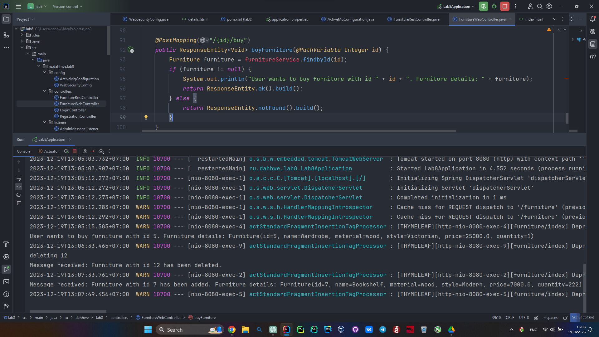

# Практическая работа №8. Spring JMS

Восьмая практическая работа по дисциплине — Разработка корпоративных информационных систем.

## Цель работы

Ознакомиться с механизмом JMS в Spring.

## Задачи

Изменить практическую работу №6, добавить следующие возможности:

- Настроить очередь (Для ActiveMQ или любого другого брокера сообщений JMS) приема сообщений для администратора;
- При выполнении операций добавления, удаления или редактирования ресурса через REST API / форму создавать
  соответствующие уведомления и отправлять их в очередь;
- Любым удобным способом (можно через терминал) продемонстрировать извлечение административных сообщений о выполненных
  операциях (из п.2);
- Добавить кнопку-ссылку «купить» на форме. После этого в брокере сообщений отправляется сообщение о том, какой
  «товар»/сущность хочет купить пользователь.

### Вариант №11

Мебель.

## Инструкция по установке и настройке PostgreSQL

### 1. Установите PostgreSQL:

Убедитесь, что на Вашем компьютере установлен [PostgreSQL](https://www.postgresql.org/download/).
Для установки PostgreSQL на Linux Ubuntu / Debian, можно воспользоваться менеджером пакетов:

```
sudo apt-get update
sudo apt-get install postgresql postgresql-contrib
```

### 2. Инициализация базы данных:

Запустите скрипт ```init.sql``` с помощью следующей команды:

```
psql -U postgres -h localhost -f init.sql
```

В этом скрипте:

- Создается таблица furniture с полями id, name, type, price, и quantity, если она не существует.
- Вставляются некоторые образцовые данные в таблицу furniture.

## Инструкция по сборке и запуску Java-проекта из командной строки

### 1. Установите JDK, Maven, а также ActiveMQ:

Убедитесь, что на Вашем компьютере
установлены:

- [JDK](https://www.oracle.com/java/technologies/downloads/)
- [Maven — фреймворк для автоматизации сборки проектов](https://maven.apache.org/)
- [ActiveMQ — брокер сообщений ](https://activemq.apache.org/components/classic/download/)

Вы можете проверить это,
выполнив в командной строке следующуе команды:

```
java -version
```

```
mvn -version
```

```
activemq start
```

### 2. Компиляция и запуск:

#### 2.1 Запуск сервера

Откройте терминал и перейдите в директорию проекта core7, затем выполните следующие команды:

```
mvnw clean package
java -jar .\target\lab8-0.0.1-SNAPSHOT.jar
```

#### 2.2 Интеграция с Apache ActiveMQ

##### Настройка брокера сообщений

Для интеграции с Apache ActiveMQ, убедитесь, что брокер сообщений активен и доступен по установленным портам (по
умолчанию 61616).

##### Настройка Spring JMS

В проекте используется Spring JMS для взаимодействия с брокером сообщений. Параметры подключения к ActiveMQ указаны в
файле application.properties:

```
# ActiveMQ Broker URL
spring.jms.url=tcp://localhost:61616

# ActiveMQ user credentials
spring.jms.user=admin
spring.jms.password=admin
```

Убедитесь, что параметры spring.jms.url, spring.jms.user, и spring.jms.password соответствуют вашей конфигурации Apache
ActiveMQ.

#### 2.3 Пример работы ActiveMq

При покупке, удалении, обновлении и добавлении мебели на сайте. Соответственные сообщения отправляются
в брокере сообщений и далее выводятся в консоль сервера в приложении.

Страница сайта с возможностью покупки:


Выводы в консоль, при совершенных операциях:

